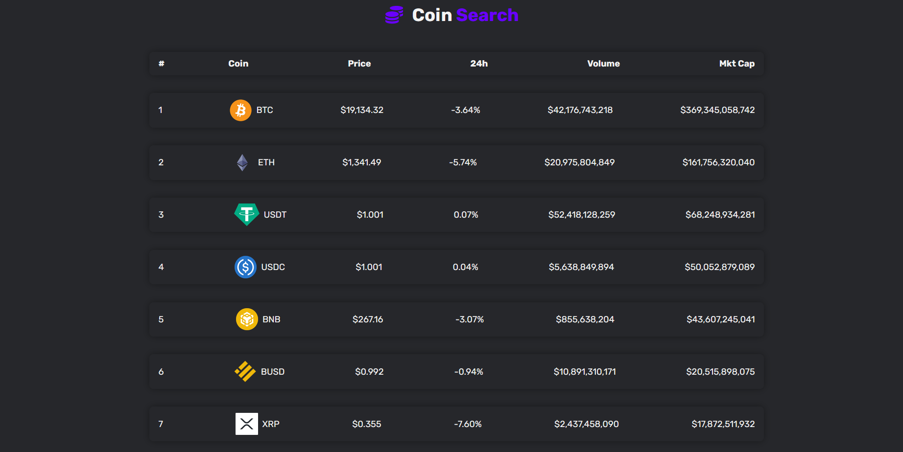
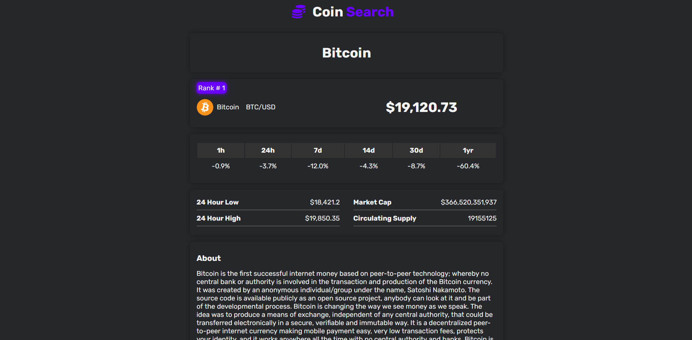
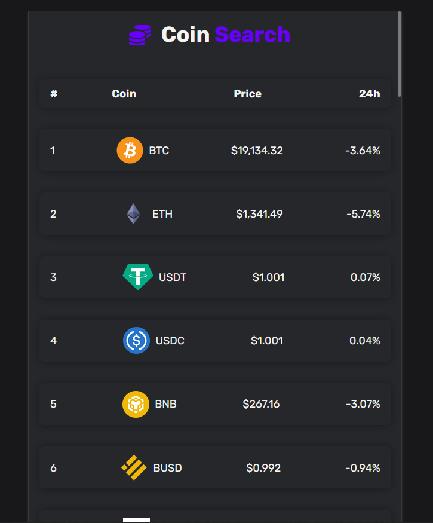
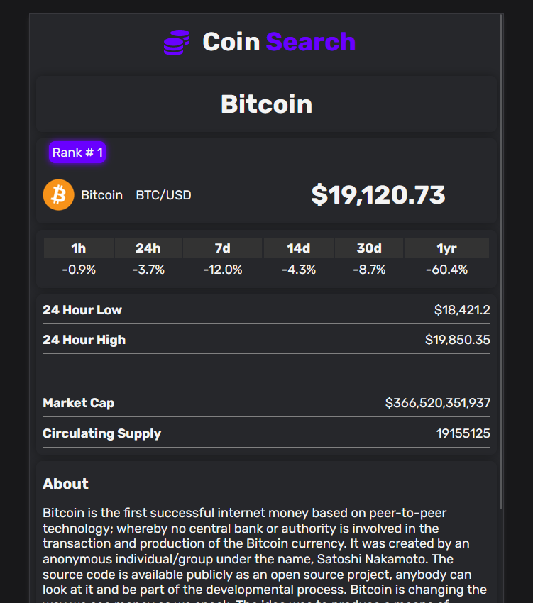

# Crypto App React - vitejs

### Mobile View

- useState and useEffect hook to interact with the API
- react router dom v6
- dynamic data
- fetch external API
- install axios
- install google fonts
- install react icons
- useParams hook

API -www.coingecko.com

- Go to Products > Crypto API
- /coins/markets
- 10 per page

Add route and pages

- install react router dom

Coin gecko

- /coins/{id}

- install dompurify
